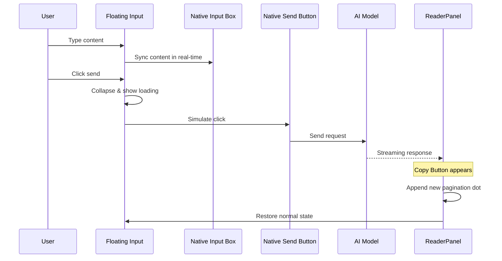
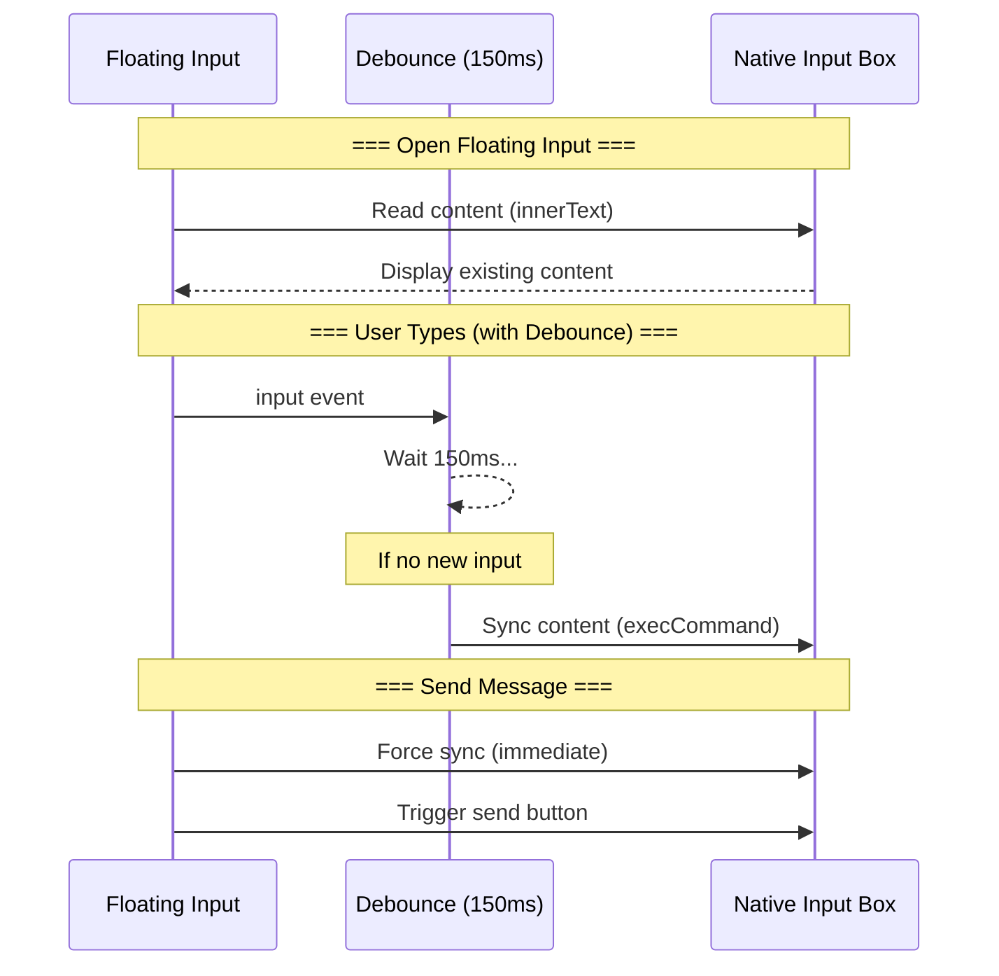
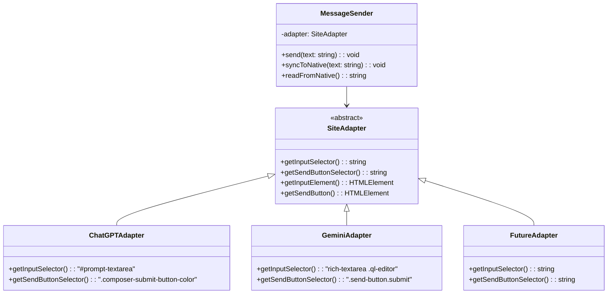

# PRD: 阅读器消息发送功能

## 1. 概述

### 1.1 背景
用户在使用 ReaderPanel 阅读长文（如 Deep Research）时，经常需要针对内容进行追问。目前需要关闭阅读器面板，回到原页面输入问题，这打断了阅读流程。

### 1.2 目标
在 ReaderPanel 中增加消息发送功能，让用户无需离开阅读器即可向 AI 追问。

### 1.3 设计原则
- **安全优先**：不直接调用平台 API，通过模拟用户输入到原生输入框 + 触发原生发送按钮实现
- **平台解耦**：核心逻辑与平台无关，通过 Adapter 模式支持新平台扩展
- **无缝同步**：浮动输入框与官方输入框内容双向同步
- **沿用设计语言**：UI 风格与 ReaderPanel 保持一致

---

## 2. 功能规格

### 2.1 入口
| 元素 | 描述 |
|:---|:---|
| **触发按钮** | 位于 ReaderPanel 内的浮动按钮（固定位置） |
| **按钮图标** | 消息/对话气泡图标 |
| **交互** | 点击后弹出浮动输入框 |

### 2.2 浮动输入框

#### 2.2.1 UI 规格
| 属性 | 描述 |
|:---|:---|
| **样式** | 沿用 ReaderPanel 设计语言（圆角、半透明背景、Design Tokens） |
| **尺寸** | 支持用户拖拽调节大小（CSS `resize: both`） |
| **动画** | 从底部滑出展开（`transform: translateY`），收起时反向动画 |
| **收起按钮** | 浮动框顶部包含收起按钮（向下箭头图标） |
| **滚动** | 内容超出时支持滚动 |

#### 2.2.2 交互规格
| 操作 | 行为 |
|:---|:---|
| **Enter** | 换行（不发送） |
| **Shift+Enter** | 换行（不发送） |
| **点击发送按钮** | 发送消息（唯一发送方式） |
| **点击收起按钮** | 收起浮动框（内容同步到官方输入框） |
| **点击外部区域** | 收起浮动框（内容同步到官方输入框） |

### 2.3 发送按钮

| 状态 | 描述 |
|:---|:---|
| **默认** | 纯图标（发送箭头） |
| **发送中/等待回复** | 加载动画（转圈/脉冲），禁用点击 |
| **回复完成** | 恢复默认状态 |

### 2.4 发送流程



### 2.5 双向同步机制

> [!IMPORTANT]
> 浮动输入框与官方输入框必须保持内容一致，以避免用户困惑。



**同步时机：**

| 事件 | 同步方向 | 方法 |
|:---|:---|:---|
| 打开浮动框 | Native → Float | `innerText` 读取 |
| 用户输入 | Float → Native | **Debounce 150ms** 后同步 |
| 发送消息 | Float → Native | **立即强制同步** + 触发发送 |
| 收起浮动框 | Float → Native | **立即强制同步** |

**性能优化：Debounce + 强制同步**

```typescript
// 防抖同步：用户停止输入 150ms 后才同步
const debouncedSync = debounce((text: string) => {
    syncToNativeInput(text);
}, 150);

floatInput.addEventListener('input', () => {
    debouncedSync(floatInput.innerText);
});

// 发送前强制同步（确保内容一致）
function onSend() {
    debouncedSync.cancel();  // 取消待执行的防抖
    syncToNativeInput(floatInput.innerText); // 立即同步
    triggerNativeSend();
}
```

**关键实现细节：**
- 使用 150ms debounce 避免每次击键都触发 DOM 操作
- 发送/收起时强制同步，确保内容无遗漏
- 同步使用「先清空再写入」策略（选中全部 + insertText）
- 不监听官方输入框的变化，避免循环

---

## 3. 消息更新机制

### 3.1 新消息感知

| 项目 | 描述 |
|:---|:---|
| **检测信号** | 复用现有的 Copy Button 监控机制 |
| **触发时机** | `button[aria-label="Copy"]` 出现时 |
| **分页器行为** | 在末尾追加新的分页点，不自动跳转 |

### 3.2 懒加载策略

| 消息位置 | 缓存策略 |
|:---|:---|
| **非最后一条** | 首次加载后缓存到 `LRUCache` |
| **最后一条** | **永不缓存**，每次点击都重新从 DOM 获取 |

> [!IMPORTANT]
> 「最后一条永不缓存」确保用户看到的最新回复始终是最新内容，避免看到过期的流式输出片段。

---

## 4. 平台适配（基于 Mock HTML 实测）

> [!IMPORTANT]
> 以下选择器均来自 `mocks/ChatGPT-All.html` 和 `mocks/Gemini-All.html` 的实际调研。

### 4.1 ChatGPT 平台

**输入框结构：**
```html
<div contenteditable="true" translate="no"
     class="ProseMirror" id="prompt-textarea"
     data-virtualkeyboard="true">
    <p data-placeholder="Ask anything" class="placeholder">...</p>
</div>
```

| 元素 | 选择器 | 说明 |
|:---|:---|:---|
| **输入框** | `#prompt-textarea` | ProseMirror contenteditable div |
| **发送按钮** | `.composer-submit-button-color` | 仅在输入内容后才显示为发送按钮（空内容时显示语音按钮） |

**特殊情况**：ChatGPT 使用 ProseMirror 编辑器，空状态时发送按钮被语音按钮替代。需要先输入内容触发按钮切换。

---

### 4.2 Gemini 平台

**输入框结构：**
```html
<rich-textarea>
    <div class="ql-editor" contenteditable="true">...</div>
</rich-textarea>
```

**发送按钮结构：**
```html
<div class="send-button-container disabled inner">
    <button mat-icon-button
            class="send-button submit"
            aria-label="发送"
            aria-disabled="true">
        <mat-icon fonticon="send" class="send-button-icon">...</mat-icon>
    </button>
</div>
```

| 元素 | 选择器 | 说明 |
|:---|:---|:---|
| **输入框** | `rich-textarea .ql-editor[contenteditable="true"]` | Quill 编辑器 |
| **发送按钮** | `.send-button-container .send-button.submit` | `aria-disabled="true"` 时禁用状态 |

---

### 4.3 内容同步策略（打开浮动框时读取官方输入框内容）

> [!NOTE]
> 当官方输入框已有内容时，打开浮动输入框需要读取并显示该内容。

**安全读取方式（只读操作，无风险）：**

```typescript
function safeReadInputValue(editor: HTMLElement): string {
    // innerText 会保留换行，是最可靠的读取方式
    // 对于 ProseMirror 和 Quill 编辑器都适用
    return editor.innerText.trim();
}
```

**平台特定实现：**

| 平台 | 读取选择器 | 方法 |
|:---|:---|:---|
| ChatGPT | `#prompt-textarea` | `element.innerText` |
| Gemini | `rich-textarea .ql-editor` | `element.innerText` |

**为什么使用 `innerText` 而非 `textContent`：**
- `innerText` 会考虑 CSS 样式，保留用户可见的换行
- `textContent` 会返回所有文本包括隐藏的 placeholder
- 两个平台的编辑器都在 `<p>` 标签内存储内容，`innerText` 能正确处理

---

### 4.4 安全写入策略（多层回退）

> [!CAUTION]
> `document.execCommand` 已被 W3C 废弃，但仍在所有主流浏览器中工作。
> 必须实现多层回退以确保未来兼容性。

**推荐方案：三层回退策略**

```typescript
function safeSetInputValue(editor: HTMLElement, text: string): void {
    editor.focus();
    selectAllContent(editor);
    
    // 层 1: execCommand（当前最可靠，与用户输入等价）
    if (document.execCommand('insertText', false, text)) {
        return; // 成功
    }
    
    // 层 2: InputEvent（现代框架能识别）
    const inputEvent = new InputEvent('beforeinput', {
        inputType: 'insertReplacementText',
        data: text,
        bubbles: true,
        cancelable: true
    });
    if (editor.dispatchEvent(inputEvent)) {
        editor.dispatchEvent(new InputEvent('input', { bubbles: true }));
        return;
    }
    
    // 层 3: 直接 DOM 操作（最后手段）
    editor.innerText = text;
    editor.dispatchEvent(new Event('input', { bubbles: true }));
}

function selectAllContent(editor: HTMLElement): void {
    const selection = window.getSelection();
    const range = document.createRange();
    range.selectNodeContents(editor);
    selection?.removeAllRanges();
    selection?.addRange(range);
}
```

---

### 4.5 发送按钮状态检测（MutationObserver）

> [!NOTE]
> ChatGPT 空输入时为语音按钮，Gemini 按钮为 `aria-disabled="true"`。
> 内容同步后需等待 DOM 更新完成才能点击发送。

**最佳实践：MutationObserver + Promise**

```typescript
function waitForSendButtonReady(maxWait = 2000): Promise<HTMLElement | null> {
    return new Promise((resolve) => {
        const adapter = adapterRegistry.getAdapter();
        
        // 先检查当前状态
        const btn = adapter.getSendButton();
        if (btn && isSendButtonEnabled(btn)) {
            resolve(btn);
            return;
        }
        
        // 使用 MutationObserver 监听属性变化
        const observer = new MutationObserver(() => {
            const btn = adapter.getSendButton();
            if (btn && isSendButtonEnabled(btn)) {
                observer.disconnect();
                resolve(btn);
            }
        });
        
        // 监听输入框区域的变化
        const inputArea = document.querySelector(
            adapter.getSendButtonSelector()
        )?.closest('form, [role="main"]');
        
        if (inputArea) {
            observer.observe(inputArea, {
                attributes: true,
                attributeFilter: ['disabled', 'aria-disabled', 'class'],
                subtree: true
            });
        }
        
        // 超时处理
        setTimeout(() => {
            observer.disconnect();
            resolve(null);
        }, maxWait);
    });
}

function isSendButtonEnabled(btn: HTMLElement): boolean {
    return !btn.hasAttribute('disabled') &&
           btn.getAttribute('aria-disabled') !== 'true';
}
```

---

### 4.6 事件监听器清理（防止内存泄漏）

> [!WARNING]
> 绑定到 `document` 的监听器必须在组件销毁时移除。

**清理模式**

```typescript
class ReaderPanel {
    private cleanupFunctions: (() => void)[] = [];
    
    private setupFloatingInputEvents(): void {
        const handleOutsideClick = (e: MouseEvent) => {
            if (!this.floatingInput?.contains(e.target as Node)) {
                this.hideFloatingInput();
            }
        };
        
        const handleInput = () => {
            this.debouncedSync(this.floatingInput!.innerText);
        };
        
        document.addEventListener('click', handleOutsideClick);
        this.floatingInput!.addEventListener('input', handleInput);
        
        // 保存清理函数
        this.cleanupFunctions.push(() => {
            document.removeEventListener('click', handleOutsideClick);
            this.floatingInput?.removeEventListener('input', handleInput);
        });
    }
    
    hide(): void {
        // 执行所有清理
        this.cleanupFunctions.forEach(fn => fn());
        this.cleanupFunctions = [];
        // ... 其他清理逻辑
    }
}
```

---

### 4.7 发送状态锁（禁止重复发送）

> [!IMPORTANT]
> 禁止快速双击和流式响应中再次发送。

```typescript
class ReaderPanel {
    private isSending: boolean = false;
    
    private async onSendClick(): Promise<void> {
        if (this.isSending) return; // 忽略重复点击
        
        this.isSending = true;
        this.setSendButtonState('loading');
        
        try {
            await this.doSend();
            await this.waitForStreamComplete();
        } finally {
            this.isSending = false;
            this.setSendButtonState('normal');
        }
    }
}
```

---

## 5. 技术方案

### 5.1 新增模块

| 文件 | 职责 |
|:---|:---|
| `src/content/features/message-sender.ts` | 消息发送核心逻辑（输入同步、模拟发送） |
| `src/content/components/FloatingInput.ts` | 浮动输入框 UI 组件 |
| `src/content/utils/ReaderPanelStyles.ts` | 新增浮动输入框相关样式 |

### 5.2 修改模块

| 文件 | 修改内容 |
|:---|:---|
| `src/content/features/re-render.ts` | 添加发送按钮入口、集成 FloatingInput |
| `src/content/adapters/base.ts` | 新增 `getInputSelector()`, `getSendButtonSelector()` 抽象方法 |
| `src/content/adapters/chatgpt.ts` | 实现 ChatGPT 的输入框/发送按钮选择器 |
| `src/content/adapters/gemini.ts` | 实现 Gemini 的输入框/发送按钮选择器 |
| `src/content/observers/mutation-observer.ts` | 暴露「流式完成」事件供 ReaderPanel 订阅 |

### 5.3 平台解耦架构



**扩展新平台只需：**
1. 新建 `XxxAdapter extends SiteAdapter`
2. 实现 `getInputSelector()` 和 `getSendButtonSelector()`
3. 在 `adapterRegistry` 中注册

### 5.4 缓存策略调整

```typescript
// re-render.ts - renderMessage 方法修改
private async renderMessage(index: number): Promise<void> {
    const item = this.items[index];
    const isLastItem = index === this.items.length - 1;
    
    // 最后一条：永不使用缓存
    let html = isLastItem ? undefined : this.cache.get(index);
    
    if (!html) {
        const markdown = await resolveContent(item.content);
        const result = await MarkdownRenderer.render(markdown);
        html = result.success ? result.html! : result.fallback!;
        
        // 只缓存非最后一条
        if (!isLastItem) {
            this.cache.set(index, html);
        }
    }
    // ... render to DOM
}
```

---

## 6. 边界情况

| 场景 | 处理方式 |
|:---|:---|
| 官方输入框有长内容 | 浮动框打开时完整显示，支持滚动 |
| 发送后官方输入框 | 清空（符合预期） |
| 网络异常/发送失败 | 按钮恢复正常，保留输入内容（由原生平台处理错误提示） |
| 用户快速连续发送 | 发送中状态时按钮禁用，防止重复发送 |

---

## 7. 验收标准

- [ ] 点击触发按钮，浮动输入框正确弹出
- [ ] 浮动输入框内容与官方输入框双向同步
- [ ] Enter/Shift+Enter 只换行，不发送
- [ ] 点击发送后，消息通过官方流程发送
- [ ] 发送后浮动框收起，按钮显示加载态
- [ ] AI 回复完成后，分页器追加新点，按钮恢复
- [ ] 点击最后一条消息时始终获取最新内容
- [ ] ChatGPT 和 Gemini 平台均正常工作
