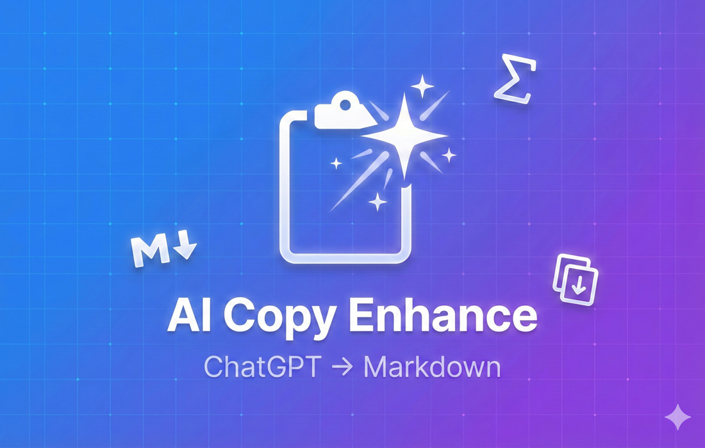
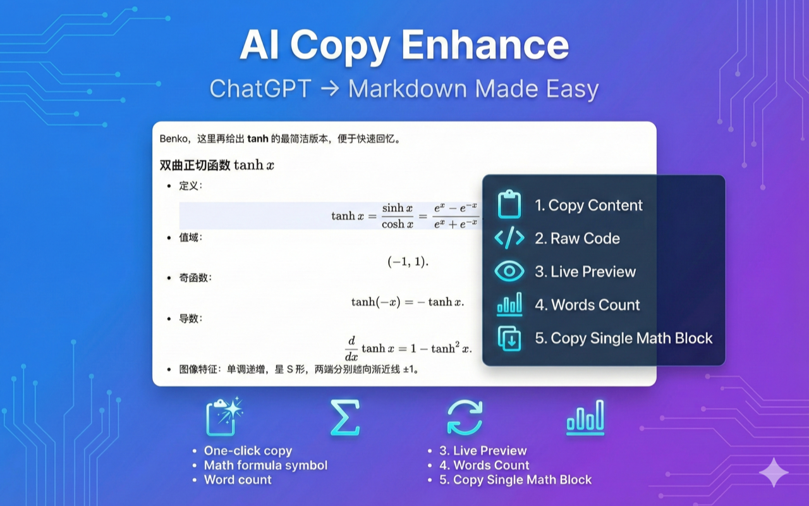

<div align="center">
  
  <h1>AI Copy Enhance</h1>
  <p><strong>ChatGPT Markdown Export Made Easy ✨</strong></p>
  
  [中文文档](./README.zh-CN.md) | English
</div>

---

<p align="center">
  
</p>

---

## 🤔 Is This For You?

- Are you frustrated by **math formulas breaking** when copying from ChatGPT?
- Do you need to copy **individual math formulas** from within paragraphs?
- Do you want to **copy specific parts** instead of the entire conversation?
- Are you tired of **unreadable content** due to failed formula rendering (especially in **Deep Research** long outputs)?

If any of these pain points resonate with you, this extension is perfect for you. 😉

---

## Interface

<p align="center">
  
</p>

---

## ✨ Features

### 📐 Click-to-Copy Math Formulas

- Click to copy individual formulas **during real-time streaming output**
- Automatically extract LaTeX formulas from AI responses
- Support both **inline formulas** (`$...$`) and **block formulas** (`$$...$$`)
- Direct compatibility with Typora, Obsidian, and other Markdown editors

### 🧾 One-Click Markdown Export

- Copy the complete conversation as **Markdown source code** with one click
- Automatically wrap formulas with `$...$` and `$$...$$`
- Convert `\\[\\]`, `\\(\\)` wrapped formulas to standard `$...$` and `$$...$$`
- Remove citation marks, hyperlinks, and other noise from ChatGPT content for cleaner Markdown

### 🪟 Markdown Source Panel

- Display the conversation's Markdown source in a **dedicated panel**
- Copy as much or as little as you need with free selection
- Perfect for scenarios where you only need "a small section"

### 🔄 Live Preview with Re-rendering

- Parse and **re-render** Markdown in a preview panel
- "Reset the reading experience" for Deep Research long texts and formula/table/text mixed content
- Especially useful when ChatGPT's rendering fails

### 📊 Word Count Statistics

- Real-time display of **word count** for the current conversation
- Separate counts for **Chinese characters** and **Latin words**
- Helps you quickly assess content length

---

## 🚀 Quick Start

### Installation

1. Download or clone this repository
2. Run `npm install` to install dependencies
3. Run `npm run build` to build the extension
4. Open Chrome and navigate to `chrome://extensions/`
5. Enable "Developer mode"
6. Click "Load unpacked" and select the `dist` directory

### Usage

1. Visit [ChatGPT](https://chatgpt.com/)
2. Start a conversation
3. You'll see the toolbar appear below AI responses
4. Click buttons to:
   - **Copy Markdown**: Copy the entire message as Markdown
   - **View Source**: View Markdown source code
   - **Preview**: Re-render and preview Markdown
5. Click on any math formula to copy it individually

---

## 🛠️ Tech Stack

- **TypeScript** - Type-safe development
- **Vite** - Fast build tool
- **Turndown** - HTML to Markdown conversion
- **Marked** - Markdown rendering
- **KaTeX** - Math formula rendering
- **Shadow DOM** - Style isolation

---

## 📝 Development

```bash
# Install dependencies
npm install

# Development mode (with hot reload)
npm run dev

# Build for production
npm run build

# Type checking
npm run type-check
```

---

## 🤝 Contributing

Issues and Pull Requests are welcome!

---

## 📄 License

MIT License

---

## 🙏 Acknowledgments

Many thanks to the [AITimeline](https://github.com/houyanchao/AITimeline) project for its inspiration and reference to this project.

---

<div align="center">
  Made with ❤️ for better ChatGPT experience
</div>
